<div align="center">
  
</div>

# J.A.R.V.I.S.

<div align="center">

<a href="LICENSE"></a>
<a href="https://www.python.org/downloads/"></a>
<a href="https://pypi.org/project/jarvis-agent/"></a>
<a href="https://github.com/aceFelix/jarvis/actions"></a>
<a href="https://www.deepseek.com"></a>
<a href="https://bailian.console.aliyun.com"></a>
<a href="#disclaimer"></a>
<a href="#development-references"></a>
<a href="#development-references"></a>
<a href="https://github.com/aceFelix/jarvis"></a>

</div>

<div align="center">

🌐 [简体中文](README.md) | English

</div>


> **J**ust **A** **R**ather **V**ery **I**ntelligent **S**ystem
>
> "At your service, sir."

An AI Agent smart butler built for personal computers — a tribute to JARVIS from *Iron Man*. It chats with you, operates your computer, stays in the background awaiting your call, listens and speaks. It brings a "terminal-native, tool-driven, extensible" intelligent assistant to your own personal computer system.

---

## Table of Contents

- [Platform Support](#platform-support)
- [Installation](#installation)
- [Quick Start](#quick-start)
- [Configuration Guide](#configuration-guide)
- [Core Concepts](#core-concepts)
  - [Five-Layer Permission System](#five-layer-permission-system)
  - [Context Compaction](#context-compaction)
  - [Deferred Tool Loading](#deferred-tool-loading)
  - [Memory System](#memory-system)
  - [Skill Packs](#skill-packs)
  - [MCP Integration](#mcp-integration)
- [REPL Command Reference](#repl-command-reference)
- [Model Management](#model-management)
- [Deep Thinking Mode](#deep-thinking-mode)
- [Security](#security)
- [Performance Optimization](#performance-optimization)
- [Voice Features](#voice-features)
  - [Voice Conversation `/voice`](#voice-conversation-voice)
  - [Real-time Duplex `/talk`](#real-time-duplex-talk)
  - [TTS Playback `/say`](#tts-playback-say)
  - [Recording Recognition `/listen`](#recording-recognition-listen)
- [Image Input](#image-input)
- [GUI Automation](#gui-automation)
- [Daemon Mode (JARVIS Form)](#daemon-mode-jarvis-form)
- [Multi-Agent Collaboration](#multi-agent-collaboration)
- [Plugin System](#plugin-system)
- [CLI-Anything External Software Control](#cli-anything-external-software-control)
- [Email Sending](#email-sending)
- [Dev Server](#dev-server)
- [Tool Self-Healing](#tool-self-healing)
- [Directory Structure](#directory-structure)
- [Testing & CI](#testing--ci)
- [Auto-Publish Workflow](#auto-publish-workflow)
- [Development Roadmap](#development-roadmap)
- [License](#license)
- [Disclaimer](#disclaimer)
- [Development References](#development-references)

---

## Platform Support

| Feature | Windows | macOS | Linux |
|---|---|---|---|
| REPL chat + file/command tools | ✅ | ✅ | ✅ |
| LLM Provider (OpenAI / Anthropic / DashScope) | ✅ | ✅ | ✅ |
| MCP integration / session memory / context compaction | ✅ | ✅ | ✅ |
| Rich terminal UI + boot animation | ✅ | ✅ | ✅ |
| Voice conversation `/voice` (STT + TTS) | ✅ | ✅ | ✅ |
| Real-time duplex voice `/talk` (full duplex) | ✅ | ✅ | ✅ |
| Real-time chat window (Arc Reactor animation) | ✅ | ✅ | ✅ |
| Mouse / keyboard / screenshot (pyautogui) | ✅ | ✅¹ | ✅² |
| Camera / vision monitoring | ✅ | ✅ | ✅ |
| `--daemon` background mode | ✅ | ✅ | ⚠️ Foreground only³ |
| Auto-start on boot | ✅ Startup | ✅ LaunchAgent | ❌ Manual systemd |
| Desktop shortcut | ✅ .lnk | ✅ .command | ⚠️ Runs in terminal⁴ |
| Global hotkey | ✅ | ❌ | ⚠️ Requires root |

> ¹ macOS requires granting terminal/Python access in "System Settings → Privacy & Security → Accessibility"
> ² Linux mouse/keyboard operations require DISPLAY environment variable (X11/Wayland desktop environment)
> ³ On Linux, `--daemon` runs in foreground mode (cannot detach to background), but all features work
> ⁴ Linux desktop shortcut double-click runs jarvis in terminal as REPL (equivalent to Windows cmd window; closing the window exits)

> ⚠️ **Important**: This project was fully developed and tested on **Windows**. macOS and Linux have code-level adaptations but **have not undergone complete real-machine testing**; there may be undiscovered compatibility issues. For the best experience, it is recommended to use J.A.R.V.I.S. on Windows.

---

## Installation

### Install from PyPI (Recommended)

```bash
# One-click full installation (voice + GUI + daemon + MCP + browser + camera/vision + real-time chat window)
pip install "jarvis-agent[all]"

# Install core chat functionality only
pip install jarvis-agent
```

### Install from GitHub

```bash
# Clone the repository
git clone https://github.com/aceFelix/jarvis.git
cd jarvis

# Install core package (development mode)
pip install -e .

# Full installation in development mode
pip install -e ".[all]"
```

### Install with uv (Faster)

[uv](https://docs.astral.sh/uv/) is a high-performance Python package manager written in Rust, recommended for new users:

```bash
# Install as a global tool
uv tool install "jarvis-agent[all]"

# Then just run
jarvis
```

### Install with npm

One-click install via npm:

```bash
npm install -g @acefelix/jarvis

# Then just run
jarvis
```

> **Requirements**:
> - **Node.js ≥ 18** (Node 20 LTS or higher recommended; Node 14/16 are EOL)
> - **Python 3.11+** in PATH
>
> The npm package automatically detects the Python environment and installs `jarvis-agent[all]` via pip.

### Default Installation Paths

The installation method determines the location of the **program itself** (follows Python / package manager), while **user data** is uniformly stored in `~/.jarvis` (independent of Python).

**Program itself:**

| Install Method | Package (agent) Location | `jarvis` Entry |
|---|---|---|
| pip (system Python) | `PythonInstallDir\Lib\site-packages` (Windows)<br>`/usr/lib/python3.x/site-packages` or `~/.local/lib/python3.x/site-packages` (Linux/macOS) | `PythonInstallDir\Scripts\jarvis.exe` (Windows)<br>`~/.local/bin/jarvis` (Linux/macOS) |
| pip (venv virtualenv) | `<venv>\Lib\site-packages` (Windows)<br>`<venv>/lib/python3.x/site-packages` (Linux/macOS) | `<venv>\Scripts\jarvis.exe` (Windows)<br>`<venv>/bin/jarvis` (Linux/macOS) |
| GitHub dev mode (`pip install -e .`) | editable install, `agent` package points directly to cloned source directory | Same as above (entry generated in Scripts/bin) |
| uv (`uv tool install`) | Windows: `%APPDATA%\uv\tools\jarvis-agent`<br>Linux/macOS: `~/.local/share/uv/tools/jarvis-agent` (uv-managed isolated venv) | `~/.local/bin/jarvis` (uv auto-links) |
| npm (`npm install -g`) | npm package in global node_modules (Windows: `%APPDATA%\npm\node_modules`; Linux/macOS: `/usr/lib/node_modules` or `~/.npm-global`); Python package installed by install.js into the corresponding Python's site-packages | `jarvis` in npm global bin directory (Windows: `%APPDATA%\npm`) |

**User data (unified across all install methods, preserved on uninstall/reinstall):**

| Content | Path |
|---|---|
| Config (`settings.toml`, including API key) | `~/.jarvis/settings.toml` (Windows: `C:\Users\<username>\.jarvis`) |
| daemon log | `~/.jarvis/daemon.log` |
| Plugins / skills / session memory | `~/.jarvis/` |
| Screenshot temp directory | `%TEMP%\jarvis-shots` (Windows) `/tmp/jarvis-shots` (Linux/macOS) |

> **Tip**: The site-packages path follows "the Python that ran pip". When multiple Python versions are installed (3.11/3.12/3.13), use `python -m pip install` to bind to the current `python`, and `python -m pip show jarvis-agent` to check the actual install location (`Location` field).

### Install Optional Features

jarvis splits different capabilities into optional dependency groups, install on demand:

| Dependency Group | Feature | Install Command |
|---|---|---|
| `gui` | Mouse/keyboard/screenshot/window management | `pip install "jarvis-agent[gui]"` |
| `browser` | Browser automation (Playwright) | `pip install "jarvis-agent[browser]"` |
| `mcp` | MCP tool integration | `pip install "jarvis-agent[mcp]"` |
| `camera` | Camera capture | `pip install "jarvis-agent[camera]"` |
| `vision` | Real-time vision monitoring + OCR | `pip install "jarvis-agent[vision]"` |
| `voice` | Voice chat `/voice` + real-time duplex `/talk` (STT+TTS+full-duplex) | `pip install "jarvis-agent[voice]"` |
| `daemon` | Background daemon/tray/hotkey/auto-start | `pip install "jarvis-agent[daemon]"` |
| `realtime_ui` | Real-time chat standalone window (Arc Reactor animation, `/talk` visualization) | `pip install "jarvis-agent[realtime_ui]"` |
| `all` | All of the above | `pip install "jarvis-agent[all]"` |

### Platform System Dependencies

**Windows**: No additional system dependencies required, just `pip install`.

> The real-time chat window requires Edge WebView2 Runtime (usually preinstalled on Win10/11). If not installed, download from [Microsoft official site](https://developer.microsoft.com/microsoft-edge/webview2/).

**macOS**:

```bash
brew install portaudio          # pyaudio build dependency (required for voice features)
# System Settings → Privacy & Security → Accessibility → Allow Terminal/Python (required for GUI operations)
# System Settings → Privacy & Security → Microphone → Allow Terminal/Python (required for voice input)
```

**Linux (Ubuntu/Debian)**:

```bash
sudo apt install portaudio19-dev python3-pyaudio  # Voice features
sudo apt install libgtk-3-dev libnotify-dev        # System tray (pystray)
sudo apt install python3-tk                        # pyautogui screenshot dependency
```

**Linux (Fedora/RHEL)**:

```bash
sudo dnf install portaudio-devel gtk3-devel
```

---

## Quick Start

### First Use (Recommended)

```bash
jarvis --init
```
Interactive guide: select vendor → confirm model → choose multimodal/text-only → enter Key → auto-test connection → save.
Supports 11 vendors (DashScope / DeepSeek / OpenAI / Zhipu / Anthropic / Kimi / MiniMax / SiliconFlow / Xiaomi MiMo / Google Gemini / custom compatible services).

### Manual Configuration

```bash
# Default to Alibaba Cloud DashScope (qwen3.7-plus, multimodal vision model)
export DASHSCOPE_API_KEY=sk-xxx
jarvis
```

> On Windows PowerShell, use `$env:DASHSCOPE_API_KEY = "sk-xxx"` to set environment variable.

Default config is in `configs/settings.toml`; environment variables with `JARVIS_*` prefix and CLI parameters can override.
Vendor-specific environment variables: `DASHSCOPE_API_KEY` / `DEEPSEEK_API_KEY` / `ZAI_API_KEY` / `ANTHROPIC_API_KEY` / `KIMI_API_KEY` / `MINIMAX_API_KEY` / `MIMO_API_KEY`.

After launch, enter the REPL terminal interface; type your question to chat with AI:
- Type natural language directly; AI will automatically call tools to complete tasks
- Type `/` to bring up command list; Tab for auto-completion
- `Shift+Enter` for newline (Windows terminal auto-converts)
- `Ctrl+C` **interrupts at any stage** (works during LLM streaming / tool execution / thinking)

> **Desktop shortcut**: Not created automatically after installation. If you want a desktop icon, run:
> ```bash
> python -m agent.daemon.autostart desktop
> ```

### Dependency Health Check

After installation or when features don't work, run `--doctor` for one-click diagnosis of all dependency statuses:

```bash
jarvis --doctor
```

Checks (rendered with rich tables, exit code 0=all ready / 1=missing):

| Category | Check Items |
|---|---|
| 📦 Python packages | 21 optional packages including voice / system tray / system monitoring / GUI / browser / camera / vision monitoring / MCP / real-time window / WeChat / LLM core, grouped by extras with `pip install` commands |
| 🔧 System-level dependencies | Python version (>=3.11) / pip / uv (recommended) / Playwright browser / Edge WebView2 Runtime (Windows) / microphone permission prompt |
| ⚙️ Config status | Whether `~/.jarvis/settings.toml` exists / API Key configured (key content not shown) / `permissions.yaml` ready |

> Package checks use `importlib.util.find_spec` for detection, without actual import, to avoid side-effect logs from uninstalled packages.

---

## Configuration Guide

Jarvis uses three-layer config merging:

1. **Project defaults** — `configs/settings.toml` (distributed with project)
2. **User-level overrides** — `~/.jarvis/settings.toml` (auto-created, persists personal settings)
3. **Environment variable overrides** — `JARVIS_*` prefixed env vars (highest priority)

### Core Config Items

```toml
# ---- LLM ----
provider = "dashscope"          # Model provider
api_format = "openai"           # Protocol format (openai / anthropic / dashscope / zai)
model = "qwen3.7-plus"          # Default model (multimodal vision)
base_url = "https://dashscope.aliyuncs.com/compatible-mode/v1"
max_tokens = 20480              # Max output tokens per call

# ---- Runtime ----
workdir = "E:\\J.A.R.V.I.S_Work" # Default working directory
permission_mode = "yolo"         # Permission mode (default / plan / accept_edits / yolo)
max_iterations = 50              # Max tool calls per turn

# ---- Voice ----
[tts]
model = "cosyvoice-v3-flash"     # TTS model (v3-flash/v3-plus/v3.5-plus)
voice = "longanlang_v3"          # Voice (/tts-voice to switch)
volume = 50                      # Volume 0-100
speech_rate = 1.0                # Speech rate 0.5-2.0
pitch_rate = 1.0                 # Pitch 0.5-2.0

[stt]
# Three-backend auto-adaptation (based on model name):
#   qwen3-asr-*        → QwenASR (OmniRealtimeConversation, server-side VAD, highest quality)
#   paraformer-*       → ParaformerSTT (Recognition WebSocket, client-side VAD, lightweight & fast)
#   fun-asr-realtime   → ParaformerSTT (same Recognition real-time backend)
#   fun-asr-flash-*    → FunASRFlashSTT (HTTP POST file upload, non-real-time, poor /voice experience)
model = "qwen3-asr-flash-realtime"
max_seconds = 15                  # Max recording seconds
silence_seconds = 1.5             # Silence detection seconds

[voice]
barge_in = false                  # Voice barge-in: auto-interrupt during playback (off by default to avoid PyAudio conflict)
barge_in_key = true               # Keyboard barge-in: press ESC to stop during playback (on by default)

# ---- Real-time duplex voice (user-level config ~/.jarvis/settings.toml) ----
[realtime_talk]
model = "qwen-audio-3.0-realtime-flash"  # DashScope real-time voice model
voice = "longanqian"                      # Voice
auto_start = false                        # Auto-enter on daemon start

# ---- Context compaction ----
[context]
compaction = true
# Compaction triggers only when total tokens (frozen summary + active window + system prompt)
# >= context_window * compact_ratio. Never compacts below the ratio.
context_window = 128000           # Model context window size (tokens); update when switching models; never set 0
compact_ratio = 0.5               # Trigger ratio of the window (0.5 = compact only after 50%)
compact_refreeze_growth = 1.25    # Debounce: no re-compaction until total grows by this factor after last freeze
compact_max_output_tokens = 2048  # Max output tokens for the summarization request
tool_result_keep_recent = 4       # Keep recent N full tool outputs when folding (older ones collapse to one-line summaries)

# ---- Daemon mode ----
[daemon]
hotkey = "ctrl+shift+j"           # Global hotkey
tray = true                       # System tray icon
```

> 📖 Full config options see **[config-docs/configuration.md](config-docs/configuration.md)**; vendor integration see **[config-docs/providers.md](config-docs/providers.md)**; voice config see **[config-docs/voice-setup.md](config-docs/voice-setup.md)**; FAQ see **[config-docs/troubleshooting.md](config-docs/troubleshooting.md)**.

---

## Core Concepts

### Five-Layer Permission System

Jarvis has multi-layer security protection to ensure AI cannot perform unauthorized operations on your computer:

| Layer | Description |
|---|---|
| **L1 Hard Block** | Permanent denial of access to sensitive directories like `.ssh`/`.aws`/`.gnupg`; dangerous commands like `rm -rf /` permanently blocked |
| **L2 Path Guard** | Limits AI's file operation scope, prevents reading/writing critical system directories |
| **L3 Command Classification** | Classifies commands into safe/dangerous/sensitive levels; dangerous commands require confirmation |
| **L4 Permission Mode** | `default` confirm each time / `plan` read-only planning / `accept_edits` auto-approve edits / `yolo` fully automatic |
| **L5 User Confirmation** | Popup confirmation for critical operations (delete files, execute scripts) |

Switch permission mode: `/mode yolo`

### Context Compaction

Uses **layered context management** (frozen prefix + sliding window) — compacted summaries are locked as "frozen zone" never modified, subsequent request prefixes stay stable → LLM cache continuously hits.

- **Ratio-based triggering**: compaction only fires when total tokens (frozen summary + active window + system prompt) ≥ `context_window` × `compact_ratio` (default 128000 × 0.5 = 64000); below the ratio it never compacts, fully utilizing the first half of the window; after freezing, no repeated compaction until total growth reaches `compact_refreeze_growth` (default 1.25×, debounce)
- **Freeze strategy**: compacted summaries are locked as a "frozen prefix" never modified, subsequent request prefixes stay stable → LLM cache continuously hits
- **Image eviction**: Old images replaced with text placeholders to free tokens (active window only)
- **Tool result folding**: Old tool results condensed to one-line summaries (active window only)
- **Reactive compaction**: Auto-compacts and retries on Context Too Long errors
- Manual trigger: `/compact`

### Memory System

Jarvis supports multi-layer memory persistence:

- **Session memory**: Auto save/restore conversation history. Manage with `/save` `/load` `/sessions`
- **Long-term memory**: `~/.jarvis/MEMORY.md` (user-level) + `<workdir>/.jarvis/MEMORY.md` (project-level), injected into system prompt at startup
- **Profile memory**: After each session, an LLM automatically distills your preferences/habits/background (e.g. "night owl", "primary model GLM"), stored in `~/.jarvis/memory/profile.json`, and injected (capped) into the system prompt next session — Jarvis gets to know you better the more you use it. Background async distillation (default 600-second throttle, configurable via `profile_refine_interval`, no impact on response speed) + daily silent maintenance (outdated memories auto-decay). `/memory` to view / `/memory add` to add manually / `/memory del` to delete / `/memory refine` to distill immediately. A cheap model can be configured under `settings.toml` `[memory.refine]` for distillation. `/memory sync` pushes the local profile to the aceFelix knowledge graph (preview first, confirm to write; the graph is the single source of truth).
- **Knowledge-graph profile bridge**: with `[profile_bridge] enabled = true`, Jarvis pulls the aceFelix knowledge-graph profile via MCP at startup and injects it into the system prompt (structured skills/projects/interests, no re-chatting needed). Requires the `acefelix-knowledge` server configured in `~/.jarvis/mcp.json`.
- **Auto recovery**: After abnormal exit, next startup auto-prompts to restore

### Skill Packs

Inject professional knowledge and workflows into AI via Skill files:

```
~/.jarvis/skills/<name>/SKILL.md        # User-level skill pack
<workdir>/.jarvis/skills/<name>/SKILL.md # Project-level skill pack
```

SKILL.md contains:
- **Frontmatter**: name / description / when_to_use / trigger_words
- **Body**: Markdown-formatted professional knowledge instructions

View loaded skills: `/skills`

### Deferred Tool Loading

After integrating 100+ tools, Jarvis uses **grouped deferred loading** strategy to control request size:

- **Core tools** (~15): Bash / FileRead / FileEdit / WebSearch and other high-frequency tools always included
- **Deferred tools** (~80): MCP / GUI / browser / camera / collaboration tools etc. only send name summaries
- **ToolSearch**: When model needs a deferred tool, search keywords to load full schema, can call next turn
- **Pure chat detection**: Short greetings ("hello", "you there?") send 0 tools, instant reply

> References Claude Code deferred tool loading mechanism, balancing feature completeness with response speed.

### MCP Integration

Supports [Model Context Protocol](https://modelcontextprotocol.io/) for external tool integration:

- Config file: `~/.jarvis/mcp.json`
- Tool naming: registered as `mcp__<server>__<tool>` format
- Default ASK permission (external process), yolo mode can relax
- View status: `/mcp`

---

## REPL Command Reference

After startup, type `/` to bring up command list; Tab for auto-completion:

### Conversation Control

| Command | Description |
|---|---|
| `/help` `/h` | View all command help |
| `/exit` `/quit` `/q` | Exit JARVIS |
| `/reset` `/clear` | Clear conversation history, start fresh |
| `/compact` | Manually compact context (summarize old messages to save tokens) |
| `/cost` | Show this session's token usage and estimated cost (including system prompt stats, cache hit rate) |
| `/context` | View context window usage (grouped by role, including system prompt tokens) |
| `/rewind [n]` | Rewind last n messages (default 1) |
| `/diff [path]` | Show git diff of working directory (can specify path) |

### Model Management

| Command | Description |
|---|---|
| `/model <prefix>` | Prefix-match switch model (supports fuzzy input, picker on multiple matches) |
| `/models` | Interactive model management (↑↓ select, Enter switch, space edit config, grouped by vendor) |
| `/think` | Toggle deep thinking mode (`/think on` / `/think off`) |

### Permission Control

| Command | Description |
|---|---|
| `/mode <mode>` | Switch permission mode (default / plan / accept_edits / yolo, picker if no arg) |
| `/tools` | List all available tools |

### Session Management

| Command | Description |
|---|---|
| `/save [name]` | Save current session |
| `/load <prefix>` | Prefix-match load saved session |
| `/loads` | List and interactively select saved sessions |
| `/sessions` `/ls-sessions` | List all saved sessions |

### Memory & Knowledge

| Command | Description |
|---|---|
| `/memory` | Profile memory management (view/add/del/clear/refine; `file` for long-term memory file) |
| `/skills` | List loaded skill packs |

### Voice Features

| Command | Description |
|---|---|
| `/voice` | Enter voice conversation mode (continuous STT→LLM→TTS loop) |
| `/talk` | Enter real-time duplex voice chat (full duplex, speak to interrupt) |
| `/tts-voice [prefix]` | Switch/add TTS voice (DashScope only) |
| `/say <text>` | TTS read specified text |
| `/listen` `/mic` | Record and recognize to text |

### Image Input

| Command | Description |
|---|---|
| `/image <path>` `/img <path>` | Add local image to pending send list |
| `/paste` `/p` `/clipboard` | Add clipboard image to pending send list |

> Images auto-attach on next message. Supported formats: PNG / JPG / WEBP / BMP. Auto-scaled to max 1280px longest side.

### Multi-Agent & Plugins

| Command | Description |
|---|---|
| `/agents` | View multi-agent team status and members |
| `/tasks` | View shared task list progress |
| `/plan` | Toggle plan mode (enter/exit read-only planning) |
| `/plugin` `/plugins` | List installed plugins (Plugin system) |
| `/plugin search [keyword]` | Search Plugin system marketplace |
| `/plugin install <name>` | Install Plugin system plugin |
| `/plugin uninstall <name>` | Uninstall Plugin system plugin |
| `/plugin info <name>` | View Plugin details |
| `/plugin update` | Check Plugin updates |
| `/plugin enable <name>` | Enable disabled Plugin |
| `/plugin disable <name>` | Disable Plugin without uninstalling |
| `/plugin create <name>` | Create Plugin scaffold |
| `/plugin validate <path>` | Validate plugin.json |
| `/cli_anything` `/harnesses` | List installed CLI-Anything harnesses |
| `/cli_anything market` | List marketplace harnesses |
| `/cli_anything install <id>` | Install specified harness |
| `/cli_anything uninstall <id>` | Uninstall specified harness |
| `/cli_anything enable <id>` | Enable disabled harness |
| `/cli_anything disable <id>` | Disable harness without uninstalling |
| `/cli_anything create <id>` | Create harness scaffold |
| `/cli_anything validate <path>` | Validate SKILL.md |

### MCP Tools

| Command | Description |
|---|---|
| `/mcp` | View MCP server connection status and tool list |

### System & Diagnostics

| Command | Description |
|---|---|
| `/init` | Interactive first-time config guide (select vendor→enter key→test→save) |
| `/doctor` | View self-healing stats and system diagnostics |
| `/config [show]` | View current effective complete config (LLM/voice/permission/MCP/custom models etc.) |
| `/server [dir]` | One-click start frontend dev server |
| `/connect-phone` `/phone` | Cross-device collaboration (phone scan to connect to current session) |
| `/connect-wechat` `/wechat` | WeChat scan to connect JARVIS (chat via ClawBot in WeChat) |
| `/disconnect-wechat` | Disconnect WeChat ClawBot |
| `/verbose` | Toggle verbose output (token stats, cache hits etc.) |

> Loaded Skills can also be called directly as slash commands: `/<skill-name> [args]` (dynamic skill dispatch).

---

## Model Management

### Built-in Models

Out-of-the-box, connects to Alibaba Cloud DashScope:

- `qwen3.7-plus` — Qwen 3.7 Plus (default, multimodal vision)
- `qwen3.6-plus` — Qwen 3.6 Plus
- `qwen3.6-flash` — Qwen 3.6 Flash (fast response)
- `qwen3.5-plus` — Qwen 3.5 Plus
- `qwen3.5-flash` — Qwen 3.5 Flash (fast response)

### Add Custom Models

Interactively add custom models via `/models` command, supports four API types:

| API Type | Applicable Models | Description |
|---|---|---|
| **OpenAI compatible** | DeepSeek / GPT-4o / various compatible services | Standard OpenAI API format |
| **Anthropic compatible** | Claude series | Anthropic Messages API format |
| **DashScope SDK** | qwen series native protocol | Supports MultiModalConversation and Generation dual endpoints |
| **Zhipu ZhipuAi SDK** | GLM series native protocol | Bypasses OpenAI compatibility layer for more stable responses |

Config auto-saves to `~/.jarvis/settings.toml` under `[llm.custom_models]`, persists across restarts.

### Custom Model Config Example

```toml
[llm.custom_models."deepseek-v4"]
api_format = "openai"
base_url = "https://api.deepseek.com/v1"
api_key = "sk-your-deepseek-key"
model_type = "text"              # "text" text-only / "multimodal" multimodal

[llm.custom_models."glm-4.7-flash"]
provider = "zhipu"
api_format = "zai"
api_key = "sk-your-zhipu-key"
model_type = "text"              # GLM-4.7-flash is text-only model
```

---

## Deep Thinking Mode

When enabled, model outputs `reasoning_content` (thinking process) before each reply, forming complete **Think → Act → Observe** ReAct loop.

- **Visual effect**: Thinking content displayed as dark panel "💭 Thinking Process" in terminal
- **Runtime toggle**: `/think on` / `/think off` (no restart needed)
- **Config items**:
  ```toml
  enable_thinking = true
  thinking_budget = 800  # Thinking process token limit
  ```
- **Vendor adaptation**: Uses `ThinkingConfig` config-table-driven, each vendor's thinking params auto-injected:
  - Qwen / DashScope: `enable_thinking=True` + `thinking_budget` (extra_body)
  - DeepSeek: `thinking={"type": "enabled"}` + `reasoning_effort=high` (extra_body)
  - Zhipu GLM: `thinking={"type": "enabled"}` + `reasoning_effort=high` (extra_body)
  - OpenAI / Moonshot and other vendors without thinking support auto-skip
- **Voice mode**: Auto-disables thinking (reduces first-token latency)

---

## Security

### API Key Encrypted Storage

J.A.R.V.I.S uses OS-native credential managers for encrypted API Key storage, replacing plaintext TOML files:

- **Windows**: Windows Credential Manager (WinVaultKeyring)
- **macOS**: Keychain
- **Linux**: Secret Service / KWallet

Storage prioritizes keyring, falls back to TOML plaintext on failure. Reads follow env var → keyring → TOML priority.

### Operation Audit Log

All tool calls auto-logged to `~/.jarvis/tool_audit.jsonl`: tool name, params, permission mode, duration, success/failure, write-op flag. Write operations under yolo mode (FileWrite / Bash / DeleteFile etc.) specially marked.

### Sensitive Field Masking

All API Keys auto-masked as `sk-xxxx...xxxx` in `/config show`, `/doctor`, and error messages.

---

## Performance Optimization

| Optimization | Description |
|---|---|
| MCP connection parallelization | 7 servers connect concurrently, startup time reduced from ΣT to max(T) |
| HTTP connection pool reuse | All Providers share httpx.AsyncClient, switching models doesn't rebuild TCP connections |
| Tool registration cache | `build_default_registry()` result cached by `@lru_cache`, only executes once across multiple calls |
| Real-time voice lazy loading | Connect WebSocket first to show "connected", MCP tools hot-load in background |
| Deferred tool loading | 14 core tools always carried, ~80 deferred tools on-demand search, zero tools for pure chat |

---

## Voice Features

Jarvis provides two independent voice systems:

| Mode | Tech Path | Features |
|---|---|---|
| **`/voice` Voice Chat** | STT → LLM → TTS pipeline | Recognize→think→playback, turn-by-turn chat |
| **`/talk` Real-time Chat** | Full-duplex WebSocket direct | Speak and listen simultaneously, interrupt AI while talking |

> The two systems run independently but share microphone hardware. Running both may cause PyAudio device conflicts.

### Voice Conversation `/voice`

After entering voice conversation mode, forms a **Listen → Think → Speak** loop:

```
🎤 Listen → STT recognize → LLM think & answer → TTS playback → 🎤 Listen → ...
```

- **Voice input**: Three STT backends available, switch by modifying `[stt].model` in `settings.toml`:

  | Config model | Backend class | Protocol | Features |
  |---|---|---|---|
  | `qwen3-asr-*` | **QwenASR** | WebSocket (OmniRealtimeConversation) | Server-side VAD, highest quality, strong Chinese-English mix |
  | `paraformer-*` | **ParaformerSTT** | WebSocket (Recognition) | Client-side VAD, lightweight & fast |
  | `fun-asr-realtime` | **ParaformerSTT** | WebSocket (Recognition) | Real-time recognition, same backend as paraformer |
  | `fun-asr-flash-*` | **FunASRFlashSTT** | HTTP POST (file upload) | Non-real-time, poor /voice loop experience, not recommended |

- **Voice output**: Two TTS modes
  - **CosyVoiceTTS**: Whole-segment synthesis playback (`cosyvoice-v3-flash` / `v3-plus` / `v3.5-plus`)
  - **StreamTTSPlayer**: WebSocket streaming synthesis, LLM outputs sentence-by-sentence → instant synthesis playback, first sentence latency ~500ms
  - Default voice `longanlang_v3`; 7 built-in voices, `/tts-voice` to switch or add custom voices
- **Interrupt mechanism**: ESC key interrupts current AI playback, or say "stand down" to exit voice mode
- **Thinking isolation**: Thinking process only shown in terminal panel, not sent to TTS
- **Content cleaning**: Auto-filters code blocks, tables, links and other content unsuitable for speech

### Real-time Duplex `/talk`

Based on DashScope real-time voice WebSocket service (`qwen-audio-3.0-realtime-flash`):

- **Full-duplex communication**: Microphone audio stream sent to model in real-time, simultaneously receives AI voice output
- **smart_turn turn detection**: Fuses acoustic perception with semantic understanding to detect speech boundaries, meaningless echo sounds won't interrupt conversation
- **AEC echo cancellation**: Based on WebRTC AEC3, eliminates speaker echo, works without headphones, preserves speak-to-interrupt capability
- **Function Calling**: Model can autonomously call tools for real-time info. Built-in time query tool, auto-integrates all ToolRegistry tools (file read/write, Bash, Glob, Grep, WebSearch, SendEmail etc.). Model judges high-risk operations per instructions, asks user for voice confirmation before executing
- **Standalone window UI**: After installing `realtime_ui`, pops up dedicated conversation window
  - Black borderless design, window auto-maximizes
  - **Arc Reactor particle animation**: Background real-time fluctuation, changes with voice volume
  - AI speaking makes reactor core glow with color change, pulse ripples expand
  - Dialog bubbles real-time display user and AI voice transcription text
- **Terminal mode**: When `realtime_ui` not installed, runs in terminal, also supports interruption
- Exit: ESC key or say "stand down"

> **AEC dependency**: Real-time chat echo cancellation depends on `aec-audio-processing` (WebRTC AEC3 Python binding) and `numpy`, included in `[voice]` optional dependency group. Auto-degrades to smart_turn-only semantic anti-echo mode when not installed.

### TTS Playback `/say`

```bash
/say Hello, I am JARVIS
```

Converts text to speech for playback. Uses DashScope CosyVoice engine.

### Recording Recognition `/listen`

```bash
/listen      # Record and output recognized text
/mic         # Alias
```

---

## Image Input

Jarvis supports attaching images in conversation (requires multimodal vision model, e.g. `qwen3.7-plus`):

```bash
/image C:\Users\me\photo.png   # Add local image
/img C:\Users\me\photo.png     # Alias
/paste                          # Add image from clipboard
/p                              # Alias
```

- Images added to pending send list, auto-attached on next message
- Supports PNG / JPG / WEBP / BMP formats
- Auto-scales to max 1280px longest side, JPEG quality 85
- Clipboard images auto-detected and deduplicated (MD5 check)

---

## GUI Automation

Jarvis can directly control mouse, keyboard, windows and screen, operating computer GUI like a human. Auto-enabled after installing `gui` dependency group:

```bash
pip install "jarvis-agent[gui]"
```

### Basic Operations

| Tool | Capability |
|---|---|
| **GetScreenSize** | Query screen resolution |
| **ScreenShot** | Full/partial screenshot, image returned to model |
| **MouseClick** | Click at absolute screen coords (supports left/right/middle, double-click) |
| **MouseDrag** | Drag from one coord to another (files, sliders, resize) |
| **MouseMove** | Move cursor |
| **MouseScroll** | Scroll wheel |
| **TypeText** | Type text (ASCII typing, Chinese via clipboard paste) |
| **KeyTap** | Key/combo keys (e.g. `["ctrl","s"]`) |

### Multi-window Coordination

When operating specific app windows, recommended to focus window first, then use window-relative coords:

```text
1. WindowFocus(title="Chrome")      # Activate window
2. WindowRect(title="Chrome")       # Get window absolute screen coords
3. WindowClick(title="Chrome", x=100, y=50)  # Click at window-relative coords
```

This way even if window was moved, `WindowClick` still accurately clicks via relative coords.

### Wait & Visual Positioning

| Tool | Capability |
|---|---|
| **WaitFor** | Wait for target image to appear on screen/region, or wait for screen to change |
| **VisualClick** | Find icon/button via template matching and auto-click |

Visual positioning suits scenarios where button/icon position isn't fixed: pass target small image, Jarvis auto-finds match position on screen and clicks, avoiding fragility of hardcoded coords.

### Right-click Menu

`MouseClick` supports `button=right`. After right-click pops up menu, can use `KeyTap` with arrow keys to select menu items and press Enter to confirm.

### Usage Principles

1. **Look before act**: Use `ScreenShot` to see screen clearly before operating, don't blind-click coords.
2. **Small steps verify**: Screenshot after each step to confirm result, then proceed to next.
3. **Dangerous ops need confirmation**: Clicks, typing, closing windows etc. state-changing ops default require user confirmation (yolo mode can disable).

---

## Daemon Mode (JARVIS Form)

```bash
jarvis --daemon          # Background start
```

### Cross-platform Behavior

| Platform | Detach Method | Description |
|---|---|---|
| Windows | `pythonw.exe` + `DETACHED_PROCESS` | Windowless process, closing terminal doesn't affect |
| macOS | `start_new_session=True` | New session detaches from terminal |
| Linux | Not supported | Runs in foreground mode |

After startup, system tray shows blue concentric circle icon.

### Tray Menu (Right-click)

| Menu Item | Behavior |
|---|---|
| **Voice Chat** | Bring up voice conversation mode |
| **Text Chat** | Pop terminal running full REPL (auto-restores last session) |
| **Real-time Chat** | Toggle real-time duplex voice chat (check=on), pops up Arc Reactor window |
| **Exit JARVIS** | Immediately terminate daemon process |

> Real-time chat window: singleton during daemon lifecycle, repeated clicks won't create new windows, only brings up existing one. Window destroyed when daemon exits.

### Auto-start / Desktop Shortcut

```bash
python -m agent.daemon.autostart install            # Install auto-start
python -m agent.daemon.autostart uninstall          # Uninstall auto-start
python -m agent.daemon.autostart status             # View status

python -m agent.daemon.autostart desktop            # Create desktop shortcut
python -m agent.daemon.autostart desktop-uninstall  # Remove desktop shortcut
```

| Platform | Auto-start | Desktop Shortcut |
|---|---|---|
| Windows | Startup folder .lnk | .lnk (points to VBS windowless launch) |
| macOS | LaunchAgent plist (`launchctl load`) | .command (opens Terminal.app) |
| Linux | Not supported (prompts manual systemd) | .desktop file |

### Real-time Duplex Config

Configure in `~/.jarvis/settings.toml`:

```toml
[realtime_talk]
api_key = "sk-xxx"              # DashScope API Key (required for real-time voice)
model = "qwen-audio-3.0-realtime-flash"
voice = "longanqian"
auto_start = false              # Whether to auto-enter real-time chat on daemon start
```

> `api_key` for `/talk` real-time duplex voice auth. Falls back to `DASHSCOPE_API_KEY` env var if not configured.
>
> Auto-enters real-time chat mode on daemon start. Tray menu can toggle anytime.

### Faster Hotkey Response (P1-2)

Daemon mode defaults to Windows native `RegisterHotKey` for global hotkey listening, faster than keyboard hooks. Fine-tunable in `~/.jarvis/settings.toml`:

```toml
[daemon]
hotkey = "ctrl+shift+j"        # Global hotkey
hotkey_native = true            # Windows prefer RegisterHotKey (faster)
hotkey_debounce_ms = 200        # Debounce ms, prevents multiple triggers per press
```

To enable immediate input in text window after hotkey press, enable warm pre-start (keeps a hidden terminal process resident):

```toml
[daemon]
text_terminal_warm = true       # Pre-start hidden text terminal, wake-to-input < 500ms (but resident in memory)
```

Text terminal can also use `--quick` for fast startup, skipping boot animation, MCP, LSP etc. optional init, lazy-loading on first use of relevant commands:

```bash
jarvis --quick                # REPL quick start
jarvis --daemon --quick       # daemon quick start (popped terminal auto-includes --quick)
```

### System Resource Monitoring

Daemon mode auto-monitors CPU / memory / disk:

```toml
[monitor]
enabled = true
cpu_threshold = 85.0       # CPU over 85% for 30s alerts
memory_threshold = 90.0    # Memory over 90% alerts
disk_threshold = 10.0      # Disk free below 10% alerts
check_interval = 10        # Check interval (seconds)
alert_cooldown = 600       # Same-type alert cooldown (10 minutes)
# P2-3 enhancements
disk_trend_days = 7        # Disk trend prediction: predict days until full
high_cpu_duration = 600    # Abnormal process: CPU > 50% for how many seconds to notify
work_break_interval = 7200 # Work 2 hours continuously, remind to rest
```

### Proactive Reminder System (P2-3)

In daemon mode, JARVIS has proactive perception, can serve proactively without user asking:

**Daily Briefing**: Auto-broadcasts today's overview at 08:30 daily (pending reminders, holidays, system status, deadlines, calendar events).

**Deadline Tracking**: Tell JARVIS "submit project report by next Friday", auto-registers deadline with tiered reminders (7/3/1/0 days before + daily after overdue).

**Reminder Escalation**: Unacknowledged reminders auto-repeat (5→10→20 minutes, up to 3 times), say "got it" to acknowledge.

**Calendar Integration** (optional): Reads Outlook/ICS calendar events, shows in briefing + reminds 30 minutes before.

```toml
[daemon]
briefing_enabled = true
briefing_time = "08:30"    # Daily briefing time

[deadline]
enabled = true
check_time = "09:00"       # Daily deadline check time

[calendar]
enabled = false            # Calendar integration (requires Outlook or ICS config)
backend = "auto"           # auto / outlook / ics
ics_path = ""              # Local .ics file path
ics_url = ""               # Remote .ics subscription URL
remind_minutes_before = 30
```

Agent tools:

| Tool | Description |
|------|------|
| `ScheduleReminder` | Schedule timed reminder ("remind me to meet at 3pm tomorrow") |
| `AddDeadline` | Register deadline ("submit report by next Friday") |
| `ListDeadlines` | View active deadlines |
| `CompleteDeadline` | Mark deadline complete |
| `AcknowledgeReminder` | Acknowledge reminder (stops escalation repeat notifications) |

### Cross-device Collaboration (P3-1)

Type `/connect-phone` in terminal, computer displays QR code, phone scans to connect to current JARVIS session, enabling remote computer control on the go.

```toml
[bridge]
http_port = 8765               # PWA page port
ws_port = 8766                 # WebSocket communication port
token = ""                     # Auth token, auto-generated if empty
```

**Usage**:
1. Type `/connect-phone` in JARVIS terminal
2. Terminal displays QR code and access URL
3. Phone and computer on same LAN Wi-Fi
4. Phone scans QR or manually accesses URL to start chatting

Terminal example:

```
🌐 Cross-device collaboration started
   Phone access: http://192.168.1.100:8765/?token=a1b2c3d4e5f6g7h8
   Phone and computer must be on same LAN (Wi-Fi)

████  ████  █  ████  ████
█  █  █  █  █  █     █  █
...

Tip: Phone scans QR or manually accesses URL above to start chatting
     Type /connect-phone to regenerate QR code
```

**Core features**:
- **Shared session**: Phone and computer share same conversation history, phone messages sync to computer terminal
- **Permission isolation**: Phone defaults to PLAN mode (read-only), write ops need phone-side confirmation
- **Streaming output**: JARVIS replies push to phone in real-time, supports Markdown rendering
- **Tool call visualization**: Phone can view tool call process and results
- **Token auth**: Each `/connect-phone` auto-generates token, prevents unauthorized access
- **Interrupt support**: Phone can interrupt JARVIS replies anytime
- **Terminal session lifecycle**: Closes when current JARVIS terminal exits

> External access requires intranet penetration (e.g. frp, Cloudflare Tunnel).

### WeChat ClawBot Integration

Type `/connect-wechat` in terminal, scan to connect WeChat ClawBot, then send messages in WeChat to chat with JARVIS (with full tool call capabilities).

**Usage**:
1. Type `/connect-wechat` in JARVIS terminal
2. Terminal displays QR code (or scan link)
3. Phone WeChat scans and confirms connection
4. Find ClawBot in WeChat and send messages to chat

**Core features**:
- **Official interface**: Based on Tencent iLink Bot API, safe and compliant, no ban risk
- **Full capabilities**: WeChat can use all JARVIS tools (files, commands, search etc.)
- **Shared session**: WeChat chat and computer terminal share same conversation history
- **24h renewal**: Connection valid for 24 hours, terminal reminds to re-scan before expiry
- **Long message segmentation**: Auto-segments messages over 2000 chars

**Dependency**: `pip install "jarvis-agent[wechat]"` (aiohttp + qrcode)

> Requires WeChat version ≥ 8.0.70, ClawBot visible in Settings → Plugins.

### Security Sandbox Execution (P3-8)

High-risk operations run in isolated environment, preventing misoperations from damaging system. Cross-platform support:

| Platform | Sandbox Mechanism | Description |
|------|------|------|
| Windows | Job Object | Memory/process count limits, KILL_ON_JOB_CLOSE terminates process tree |
| Linux | resource.setrlimit | RLIMIT_AS/CPU/NPROC resource limits |
| macOS | sandbox-exec + rlimit | Apple Sandbox command wrapper + resource limits |

**Four-level risk classification**:

| Risk Level | Strategy | Example Commands |
|------|------|------|
| LOW | Direct pass | ls, cat, git status |
| MEDIUM | Auto-pass when sandbox enabled | npm install, git commit, python script.py |
| HIGH | Forced sandbox + file snapshot | rm, del, git push --force |
| CRITICAL | Sandbox + snapshot + user confirmation | rm -rf, sudo, format, reg delete |

**File snapshot protection**: Auto-backs up target files before high-risk ops, rollback on failure (`~/.jarvis/sandbox_snapshots/`).

**Audit log**: All sandbox ops logged to `~/.jarvis/sandbox_audit.jsonl`, supports stats query.

```toml
[sandbox]
enabled = false              # Master switch
max_memory_mb = 512          # Max memory in sandbox (MB)
max_cpu_seconds = 60         # Max CPU time (seconds)
max_processes = 10           # Max child processes (anti fork bomb)
timeout = 120                # Total command timeout (seconds)
block_network = false        # Whether to block network
auto_allow_medium = true     # Auto-pass medium risk when sandbox enabled
audit = true                 # Record audit log
max_snapshots = 20           # Max file snapshots retained
excluded_commands = []       # Commands bypassing sandbox (e.g. ["docker", "wsl"])
```

---

## Dev Server

Jarvis has built-in `/server` command and `DevServer` tool for one-click frontend/Node dev server startup:

```bash
/server                                  # Start current dir project
/server jarvis-website                   # Start specified dir project
/server --port 3000                      # Specify port (auto-increments if occupied)
/server --command "pnpm run dev"         # Custom start command
/server jarvis-website --port 3000 --wait 15
```

Supported auto-detected project types:

| Project Type | Detection Basis | Default Command |
|---|---|---|
| Vite | `vite.config.*` or dep `vite` | `npm run dev` / `npx vite --port {port}` |
| Next.js | `next.config.*` or dep `next` | `npm run dev` / `npx next dev --port {port}` |
| Nuxt | `nuxt.config.*` or dep `nuxt` | `npm run dev` / `npx nuxt dev --port {port}` |
| Vue CLI | `vue.config.*` or dep `@vue/cli-service` | `npm run dev` / `npx vue-cli-service serve --port {port}` |
| Webpack | `webpack.config.*` or dep `webpack` | `npm run dev` / `npx webpack serve --port {port}` |
| Create React App | dep `react-scripts` | `npm start` (auto-injects `PORT`) |
| Gatsby | `gatsby-config.*` or dep `gatsby` | `npx gatsby develop --port {port}` |

Features:

- **Auto-detect package manager**: Selects `pnpm` / `yarn` / `npm` based on `pnpm-lock.yaml` / `yarn.lock`
- **Port auto-increment**: Auto-finds next available port when default occupied
- **Log redirection**: stdout/stderr written to `~/.jarvis/dev_server_logs/<project>_<timestamp>.log`
- **URL extraction**: Auto-extracts `http://localhost:port` from logs

AI tool: `DevServer(project_dir=..., port=..., command=...)`

---

## Tool Self-Healing

Jarvis has built-in **Tool Self-Healing**, doesn't immediately throw errors to LLM on tool call failure, but first auto-classifies, retries, degrades or asks user:

- **Error classification**: Network jitter, API rate limit, timeout, file missing, permission denied, dependency missing, config error etc.
- **Auto retry**: Temporary network errors / rate limits retry with exponential backoff
- **Auto fix**: Auto-creates parent directories when file missing; auto-extends `timeout` on timeout
- **User inquiry**: Asks user whether to retry again after retries exhausted
- **Telemetry stats**: `/doctor` shows self-healing config, error distribution, recent events

### Configuration

Configure in `configs/settings.toml` or `~/.jarvis/settings.toml`:

```toml
[self_healing]
enable_tool_self_healing = true
tool_retry_max = 3
tool_retry_backoff_base = 1.0
tool_retry_backoff_max = 30.0
```

### Command

```bash
/doctor              # View self-healing stats and system diagnostics
```

---

## Multi-Agent Collaboration

Jarvis supports spawning sub-agents for parallel complex task processing, and team collaboration mode:

- **Subagents**: Main Agent can create sub-agents for independent sub-tasks, results aggregated to continue
- **Batch parallel**: One `Agent` tool call can dispatch multiple sync sub-tasks simultaneously, results aggregated by index
- **Team mode**: Create Agent teams, assign different roles and tool sets
- **Background teammates**: `Agent` tool's `run_in_background=true` mode creates persistent teammates, join team and communicate via mailbox
- **Auto task claiming**: Idle background teammates auto-claim pending unblocked tasks from shared `TaskList` and execute
- **Plan approval**: In PLAN/ASK permission mode, teammates send `plan_approval_request` to leader before write ops, continue only after approval
- **Task management**: Shared task list, supports dependency chains, owner assignment, completion callbacks
- **Team status query**: `TeamStatus` tool views member status, task stats, unread mail count
- **Lifecycle management**: `TaskStop` tool terminates background teammates; teammates send heartbeat every 30s for liveness
- **Message mailbox**: Agents communicate via file mailboxes

Management commands: `/agents` `/tasks` `/plan`

### Typical Usage

```text
> Create code-review team, assign reviewer and tester
> Use TaskCreate to create review tasks and test tasks
> Use Agent run_in_background=true to start reviewer/tester
> Teammates auto-claim and execute tasks, notify leader via mailbox on completion
> Use TeamStatus to view progress, TaskStop to terminate teammates
```

See [docs/architecture/11-多Agent协作.md](docs/architecture/11-多Agent协作.md).

---

## Plugin System

Jarvis has two independent plugin marketplaces, each managed separately:

### Plugin System (GitHub Plugins)

```bash
/plugin                       # List installed plugins
/plugin search [keyword]      # Search Plugin system marketplace (remote + local)
/plugin install <name>        # Install plugin
/plugin uninstall <name>      # Uninstall plugin
/plugin info <name>           # View plugin details
/plugin update                # Check plugin updates
```

Plugin system by default searches both remote `marketplace.json` and local plugin marketplace directory.
Local marketplace configured in `configs/settings.toml`'s `[plugins]` table:

```toml
[plugins]
marketplace_local = "../jarvis-plugins"
```

Supports two local directory structures:
- Flat layout: `<marketplace_local>/<plugin>/plugin.json`
- Repo layout: `<marketplace_local>/plugins/<plugin>/plugin.json` (consistent with `aceFelix/jarvis-plugins` repo)

### CLI-Anything Harness (CLI Tool Wrapper)

```bash
/cli_anything                 # List installed harnesses
/cli_anything market          # List marketplace harnesses
/cli_anything install <id>    # Install specified harness
/cli_anything uninstall <id>  # Uninstall specified harness
```

### Plugin Common Features

```bash
/plugin enable <name>         # Enable disabled Plugin
/plugin disable <name>        # Disable Plugin without uninstalling
/plugin create <name>         # Create Plugin scaffold
/plugin validate <path>       # Validate plugin.json
```

**Enable/Disable**: Disabled Plugin skills are moved out of `~/.jarvis/skills/`, kept in `~/.jarvis/plugins/disabled/<name>/`, can be quickly re-enabled. State persisted to `~/.jarvis/plugins/disabled.json`.

**Plugin creation**: `/plugin create my-tool` generates `plugin.json` + `skills/` directory + `README.md` scaffold.

**Plugin validation**: `/plugin validate <path>` checks `plugin.json` compliance.

### CLI-Anything Common Features

```bash
/cli_anything enable <id>         # Enable disabled harness
/cli_anything disable <id>        # Disable harness without uninstalling
/cli_anything create <id>         # Create harness scaffold
/cli_anything validate <path>     # Validate SKILL.md
```

**Enable/Disable**: Disabled harnesses are not loaded, files preserved. State persisted to `~/.jarvis/cli_anything/disabled.json`.

**Harness creation**: `/cli_anything create my-tool` generates `SKILL.md` + `README.md` scaffold.

**Harness validation**: `/cli_anything validate <path>` checks `SKILL.md` compliance.

See [docs/architecture/10-扩展生态.md](docs/architecture/10-扩展生态.md).

---

## CLI-Anything External Software Control

Jarvis has built-in **CLI-Anything harness** mechanism, can wrap any third-party software (e.g. Blender, Obsidian, GIMP, Godot, WPS etc.) as Agent-callable tools.

### Install Harness

Place in `~/.jarvis/cli_anything/<software_name>/` directory:

- `SKILL.md`: Describes software capabilities, params, trigger scenarios
- `run.py`: Execution entry (receives `--<param_name>` and `--harness-dir`, `--workdir`)

Example:

```
~/.jarvis/cli_anything/
├── blender/
│   ├── SKILL.md
│   └── run.py
└── wps/
    └── SKILL.md       # pip-type harness only needs SKILL.md (global command already installed)
```

### SKILL.md Example

```markdown
---
name: Blender
id: blender
description: Control Blender 3D modeling software via CLI
when_to_use: When user needs to create/modify 3D models, render scenes
trigger_words: [blender, 3d, modeling, rendering]
command: python
args:
  - name: operation
    type: string
    enum: [create_mesh, render, export, info]
    required: true
    description: Operation type
  - name: prompt
    type: string
    required: false
    description: Natural language description of operation to execute
examples:
  - "Use Blender to create a cube"
---
```

### Marketplace Commands

Jarvis supports two sources: **CLI-Anything official marketplace** (CLI-Anything GitHub repo) and **jarvis custom marketplace** (e.g. jarvis-harness-market):

```text
/cli_anything market              # View marketplace available harnesses (official + custom)
/cli_anything install blender     # Install Blender harness from official repo
/cli_anything install wps         # Install WPS harness from custom marketplace (auto pip install)
/cli_anything uninstall blender   # Uninstall installed harness
/cli_anything list                # List locally installed harnesses
```

When network unavailable, command auto-falls back to local `../CLI-Anything-main` repo (if exists).

### jarvis Custom Harness Marketplace

Connect custom marketplace via `market_url` / `market_local` config (e.g. [jarvis-harness-market](https://github.com/aceFelix/jarvis-harness-market)):

```toml
# ~/.jarvis/settings.toml
[cli_anything]
market_url = "https://raw.githubusercontent.com/aceFelix/jarvis-harness-market/main"
market_local = "path/to/jarvis-harness-market"   # Local fallback path
```

Custom marketplace harnesses support two install modes:

| Mode | Description | Install Behavior |
|------|------|----------|
| **pip-type** (recommended) | Harness is standard Python package with `setup.py` + `install_cmd` | Auto `pip install` + migrate SKILL.md |
| **directory-type** | Harness is self-contained directory, no `install_cmd` | Copy entire directory to `~/.jarvis/cli_anything/<id>/` |

pip-type harness provides global command after install (e.g. `jarvis-harness-wps`), consistent with official CLI-Anything harness behavior.

### Usage

After starting Jarvis, harness auto-registers as tool `cli_anything__<id>`. Example:

```
> Use Blender to create a cube
```

Jarvis calls `cli_anything__blender`, and asks for your confirmation before execution (default ASK permission).

### Security Notes

- All harness tools default to **ASK** permission, require confirmation before execution.
- Not executed via shell, avoids command injection.
- Supports timeout and forced termination (default 120 seconds).

---

## Email Sending

Jarvis can proactively send emails to users via `SendEmail` tool, suitable for reminders, summaries, report forwarding etc.

### Configuration

Add `[email]` table in `~/.jarvis/settings.toml`:

```toml
[email]
enabled = true
smtp_host = "smtp.163.com"
smtp_port = 465
smtp_user = "your_163_email@163.com"
smtp_password = "your_authorization_code"   # 163 email authorization code, not login password
sender = "your_163_email@163.com"
default_recipient = "13985465782@136.com"   # Default recipient when user doesn't specify
```

### Usage

Just tell Jarvis in natural language:

```text
> Email me a reminder for tonight's 8pm meeting
> Send this summary to my email, subject is today's work summary
```

Jarvis calls `SendEmail`, asks for confirmation before sending. Supports specifying recipients, cc, bcc and local attachments.

---

## Directory Structure

```
agent/
├── main.py            # Entry (REPL / daemon / --talk / --doctor dispatch)
├── bootstrap.py       # Assembly factory (provider / checker / recovery / context build)
├── doctor.py          # Dependency health check (--doctor: Python packages / system deps / config)
├── model_manager.py   # Model switch and management (/model /models logic)
├── session_manager.py # Session auto-save / title generation
├── commands/          # Slash command system
│   ├── router.py      # Command routing (exact match + prefix match + dynamic skill dispatch)
│   └── handlers/      # Various command handlers (core/session/model/voice/media/plugin/collab...)
├── cli_anything/      # CLI-Anything harness integration (wrap any software as CLI)
├── core/              # Core runtime
│   ├── query_loop.py  # Conversation loop (REPL driver + voice conversation flow)
│   ├── layered_context.py # Layered context management (frozen prefix + sliding window)
│   ├── orchestrator.py # Agent orchestrator (ReAct loop)
│   ├── tool.py        # Tool protocol definition
│   ├── context.py     # Tool context + UI protocol (RealtimeTalkUI)
│   ├── message.py     # Message/content block types (Message / ContentBlock)
│   ├── result.py      # Tool call result (ToolResult)
│   ├── hooks.py       # Hook system
│   ├── diag.py        # Diagnostic log
│   ├── error_recovery.py # Tool self-healing (classify/retry/degrade/inquire)
│   ├── images.py     # Image/clipboard helper (/image /paste load and dedup)
│   ├── logging.py    # Logging
│   ├── audit/        # Tool audit log
│   ├── daemon/        # Background proactive perception (scheduler/monitor/vision watch/holidays/deadlines/calendar)
│   ├── extensions/    # External extension mechanism (MCP client/plugins/Skill loading)
│   ├── memory/        # Memory persistence (context compaction/recovery/file state/storage)
│   └── sandbox/       # Security sandbox (risk scoring/isolated execution/file guard/audit log)
├── collaboration/     # Multi-Agent collaboration framework
│   ├── subagent.py    # Subagent definition and execution
│   ├── team.py        # Agent team management
│   ├── teammate.py    # Team member
│   ├── teammate_registry.py # Teammate registry (global lifecycle management)
│   ├── mailbox.py     # Inter-agent message mailbox
│   └── task_list.py   # Shared task list
├── lsp/               # LSP code intelligence
│   ├── client.py      # LSP client
│   └── manager.py     # Multi-language LSP Server management
├── permissions/       # Five-layer permission system
│   ├── rules.py       # Permission rule definitions
│   ├── checker.py     # Permission checker
│   ├── path_guard.py  # Path security guard
│   ├── shell_classifier.py # Shell command risk grading
│   └── modes.py       # Permission modes (default/plan/accept_edits/yolo)
├── tools/             # Built-in tools (30+)
│   ├── base.py        # Base tool executor
│   ├── bash.py        # Command execution
│   ├── ask_user.py    # Ask user questions
│   ├── location.py    # IP location
│   ├── todo.py        # Task planning
│   ├── tool_search.py # Deferred tool search (ToolSearch)
│   ├── file_ops/      # File read/write/edit/search (glob/grep)
│   ├── system/        # System operations (mouse/keyboard/screen/window)
│   ├── web/           # Browser automation + network requests
│   ├── vision/        # Camera capture + vision monitoring
│   ├── collaboration/ # Multi-agent collaboration tools (subagent/team/task/plan)
│   └── extensions/    # Extension tools (LSP/marketplace/MCP agent/schedule/email/CLI-Anything)
├── llm/               # LLM abstraction layer
│   ├── base.py        # Base Provider interface
│   ├── thinking.py    # ThinkingConfig config table (thinking param strategy)
│   ├── provider_registry.py # ProviderMeta vendor registry (lazy import + URL detection)
│   ├── openai_provider.py    # OpenAI compatible protocol
│   ├── anthropic_provider.py # Anthropic Messages API
│   ├── dashscope_provider.py # DashScope SDK native protocol
│   ├── zai_provider.py       # Zhipu ZhipuAi SDK native protocol
│   └── mock.py        # Mock Provider (for testing)
├── ui/                # User interface
│   ├── cli.py         # Rich terminal REPL + command completion
│   ├── boot_animation.py # Boot animation (Arc Reactor particles + freeze-frame branching)
│   ├── markdown_renderer.py # Markdown terminal rendering
│   ├── model_picker.py # Interactive model picker
│   ├── session_picker.py # Interactive session picker
│   ├── terminal_picker.py # Interactive terminal picker
│   └── realtime_window/ # Real-time chat standalone window
│       ├── window.py  # Parent process window controller (singleton + child process management)
│       ├── process.py # Child process entry + frontend window + JSBridge
│       ├── bridge.py  # Webview ↔ RealtimeTalk bridge (UI protocol implementation)
│       └── assets/    # HTML/JS/CSS (Arc Reactor animation + dialog bubbles)
├── voice/             # Voice engine
│   ├── tts.py         # CosyVoiceTTS (whole-segment synthesis + streaming start/feed/finish + interrupt)
│   ├── stt.py         # STT three backends (QwenASR / ParaformerSTT / FunASRFlashSTT)
│   ├── stream_tts.py  # StreamTTSPlayer (sentence-level streaming TTS, play sentence by sentence)
│   ├── realtime_talk.py # /talk full-duplex real-time voice (WebSocket + AEC + Function Calling)
│   ├── voice_loop.py  # /voice voice conversation loop (listen→think→speak + conversation⇄standby state machine)
│   ├── voice_config.py # Voice config (keywords/wake words/standby params/voice system prompt)
│   ├── tts_text.py    # TTS text cleaning (markdown/<think>/tool tag stripping)
│   ├── barge_in.py    # Interrupt listener (ESC keyboard / mic energy / interrupt words)
│   ├── tts_voices.py  # TTS voice catalog (/tts-voice data source)
│   ├── audio.py       # PyAudio global singleton (prevents segfault)
│   ├── aec.py         # AEC echo cancellation (WebRTC AEC3, external playback anti-self-talk)
│   └── client_vad.py  # Client-side VAD (silence detection/voice activity detection)
├── bridge/            # Cross-device collaboration (P3-1)
│   ├── server.py      # BridgeServer (HTTP static files + WebSocket communication)
│   ├── ui.py          # BridgeUI (UIProtocol implementation, event forwarding to WS)
│   └── static/        # PWA frontend (single-file HTML, dark theme)
├── wechat/            # WeChat ClawBot integration (iLink Bot API)
│   ├── ilink.py       # iLink API client (scan login/long polling/send message)
│   ├── server.py      # WeChatBridge (message loop + singleton management + 24h reconnect)
│   └── ui.py          # WeChatUI (UIProtocol implementation, collects reply text)
├── daemon/            # Daemon mode
│   ├── daemon.py      # Daemon process (background detach/tray/hotkey/proactive service)
│   ├── tray.py        # System tray
│   ├── hotkey.py      # Global hotkey (cross-platform)
│   ├── hotkey_native.py # Windows native RegisterHotKey (faster response)
│   ├── sessions.py    # Voice session management (stop_event interrupt)
│   ├── realtime.py    # Real-time chat session management
│   ├── autostart.py   # Auto-start/desktop shortcut
│   ├── terminal_spawner.py # Terminal window spawner (warm pre-start)
│   ├── voice_state.py # Voice mutex lock and switch state
│   ├── notifications.py # System notifications
│   └── platform_utils.py # Cross-platform utilities
├── config/            # Config loading (TOML multi-source merge + env var override)
│   ├── settings.py    # Settings dataclass + TOML loading + field mapping
│   ├── env.py         # Env var override (JARVIS_* → Settings)
│   ├── keyring_store.py # API Key encrypted storage (system credential manager)
│   ├── model_registry.py # Model TOML persistence (save/load)
│   └── migrations.py  # Config migrations
├── prompts/           # System prompt assembly (dynamic thinking mode/voice mode)
└── utils/             # Common utilities
    └── mask.py        # API Key masking

tests/                 # Test suite (1599 tests, covers LLM/Config/Tools/Core/Voice/Daemon/Permission/Sandbox)
├── llm/               # Provider registry, thinking config, streaming parsing, config loading tests
├── memory/            # Session save, crash recovery, context compaction tests
├── collaboration/     # Multi-agent collaboration tests
├── core/ tools/ daemon/ voice/ # Module unit tests
├── test_command_router.py # Command routing integration tests
├── test_query_loop.py     # Context compaction/image eviction tests
├── test_query_loop_run.py # QueryLoop.run main flow/tool loop/failover tests
├── test_orchestrator.py   # Tool orchestrator tests
├── test_session_manager.py# Session title generation/save tests
├── test_permissions.py    # Five-layer permission system tests
├── test_p23_proactive.py  # Proactive perception reminder tests
└── test_p38_sandbox.py    # Security sandbox tests

.github/workflows/     # GitHub Actions CI (auto test + syntax check)
└── ci.yml             # push/PR trigger, Python 3.11-3.14 matrix

npm/                   # npm distribution package (lets Node.js users install via npm install -g)
├── package.json       # npm package definition (bin points to run.js)
├── install.js         # postinstall: detect Python + pip install jarvis-agent[all]
└── run.js             # CLI entry: forwards args to jarvis command
```

---

## Testing & CI

Project has **1599 unit/integration tests**, covering LLM Provider, tool registration, config loading, permission system, context management, session management, memory persistence, security sandbox, background daemon and other core modules. Core runtime (query_loop/orchestrator/memory/permission/LLM Provider) coverage **94%**.

```bash
# Run all tests
pytest tests/ -v

# View coverage
coverage run --source=agent -m pytest tests/ -q
coverage report
```

Every push or PR to `main` branch, **GitHub Actions auto-runs full tests** (Python 3.11 / 3.12 / 3.13 / 3.14 matrix), merge not allowed if failing.

---

## Auto-Publish Workflow

Jarvis uses **GitHub Actions + Git Tag** to publish to PyPI and npm with one command — no manual build/upload needed.

### Trigger

```bash
# 1. Update version (pyproject.toml version field + npm/package.json version field)
# 2. Commit the version bump
git add pyproject.toml npm/package.json
git commit -m "chore: bump version to 2.0.6"

# 3. Tag and push (the v prefix is required)
git tag v2.0.6
git push github v2.0.6
```

Pushing a `v*` tag triggers [publish.yml](.github/workflows/publish.yml), which automatically:
1. **Tests** — runs full pytest; aborts on failure
2. **Version consistency check** — tag version must match `pyproject.toml` / `npm/package.json`, else error
3. **Builds** — `python -m build` produces wheel + sdist
4. **Publishes to PyPI** — via Trusted Publisher (OIDC, no API token)
5. **Publishes to npm** — via `NPM_TOKEN`
6. **Creates GitHub Release** — with wheel/sdist attached, changelog auto-extracted from commits

### First-time Setup (once only)

#### PyPI Trusted Publisher (no API token)

1. Log in to [pypi.org](https://pypi.org) → Account settings → Publishing
2. Add a new pending publisher with:
   - **PyPI Project Name**: `jarvis-agent`
   - **Owner**: `aceFelix`
   - **Repository name**: `jarvis`
   - **Workflow name**: `publish.yml`
   - **Environment name**: `pypi`
3. After the first publish, the publisher auto-activates. No further config needed.

#### npm Token

1. Log in to [npmjs.com](https://www.npmjs.com) → Access Tokens → Generate New Token → **Automation** (bypasses 2FA restriction)
2. In GitHub repo → Settings → Secrets and variables → Actions → New repository secret
   - **Name**: `NPM_TOKEN`
   - **Value**: the token from the previous step

> Once configured, every `v*` tag push auto-publishes everything. No local twine, no manual `npm publish`, no API token rotation headaches.

---

## Development Roadmap

- [x] **Phase 1**: Minimum viable Agent (chat + file + command + five-layer permission)
- [x] **Phase 2**: Computer operation capabilities (GUI + multimodal vision + browser automation + camera capture)
- [x] **Phase 3**: Real-time voice (TTS + STT + `/voice` loop + `/talk` full-duplex)
- [x] **Phase 4**: Memory & ecosystem (session persistence/long-term memory/MCP integration/context compaction/Skill system)
- [x] **Phase 5**: JARVIS form (daemon resident+global hotkey+system tray+auto-start+subagent+proactive perception+vision monitoring+proactive reminder system)
- [x] **Phase 6**: Cross-platform adaptation (Windows / macOS / Linux)
- [x] **Phase 7**: Real-time chat UI (Arc Reactor animation window + full-duplex interrupt + singleton management)

---

## License

This project uses [MIT License](LICENSE).

> This project references design ideas from excellent tools like ClaudeCode. Author retains creation attribution rights.

For detailed terms, see [LICENSE](LICENSE) file.

---

## Disclaimer

J.A.R.V.I.S. is currently in **development and validation phase**, features are not yet fully stable. You may encounter minor bugs during use, purely due to my oversight in incomplete testing, for which I deeply apologize.

If you encounter any problems or poor experience during use, feedback is welcome via:

- **Email**: 13985465782@163.com

Every piece of your feedback is my motivation to improve, thanks for your support and tolerance!

---

## Development References

J.A.R.V.I.S. design and implementation references the following excellent projects and resources:

| Project / Resource | Description |
|---|---|
| [ClaudeCode (BasicProtein)](https://github.com/BasicProtein/ClaudeCode) | Core architecture reference, Agent loop and tool call design |
| [claude-code (Anthropic)](https://github.com/anthropics/claude-code) | Official Claude Code implementation, interaction paradigm and permission model reference |
| [OpenClaw](https://github.com/openclaw/openclaw) | Multi-channel AI Agent framework, plugin system and Channel abstraction reference |
| [weixin-ClawBot-API](https://github.com/SiverKing/weixin-ClawBot-API) | WeChat ClawBot iLink Bot API protocol implementation reference |
| [CLI-Anything](https://github.com/HKUDS/CLI-Anything) | CLI tool integration framework, skill extension mechanism reference |
| [DeepSeek API Docs](https://api-docs.deepseek.com) | LLM inference API docs |
| [Zhipu BigModel Docs](https://docs.bigmodel.cn/cn/guide/start/introduction) | Zhipu GLM LLM inference API docs |
| [Alibaba Cloud Bailian Platform](https://bailian.console.aliyun.com) | Real-time voice chat API (Qwen) server-side |

---
---

## Thank You for Your Support


<div align="center">

**Thank you for using J.A.R.V.I.S.!**

</div>

<div align="center">

**"J.A.R.V.I.S. — At your service, sir."**

</div>

<div>

<table>
<tr>
  <td align="center">WeChat</td>
  <td align="center">X (Twitter)</td>
  <td align="center">Douyin</td>
</tr>
<tr>
  <td></td>
  <td></td>
  <td></td>
</tr>
</table>

</div>
